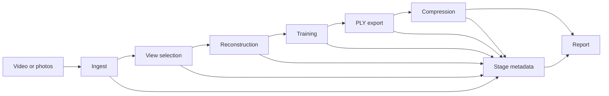

# Architecture

The repository treats a 3D Gaussian Splatting build as a sequence of explicit,
restartable stages rather than one opaque training command.

## Stage contracts

| Stage | Input | Primary output | Evidence |
| --- | --- | --- | --- |
| Ingest | video or image directory | normalized `images/` | capture metadata |
| Select | normalized images | `selected_images/` | scores, coverage, revisit candidates |
| Reconstruct | selected images and optional poses | COLMAP `sparse/0/` | reconstruction and pose decision report |
| Train | scene and reconstruction | checkpoints | selected profile, command, metrics |
| Export | checkpoint | full PLY | export report |
| Compress | full PLY | deployment variants | size, count, and compression report |
| Report | stage metadata | summary and decision trace | artifact presence and fallback decisions |

## Dependency boundary

This repository owns orchestration, metadata, export, compression, and
reporting. Feature matching, COLMAP reconstruction, and 3DGS training are
provided by separately licensed upstream projects. The Dockerfile and Conda
environment pin reviewed revisions where a Git dependency is involved, but
deployers remain responsible for checking all model, data, CUDA, and
third-party license terms.

## Validation boundary

CPU CI validates configuration, selection, metadata, export, compression,
reporting, and command construction. It does not claim that a CUDA training
run completed. GPU benchmark results must record their environment and source
revision separately.
